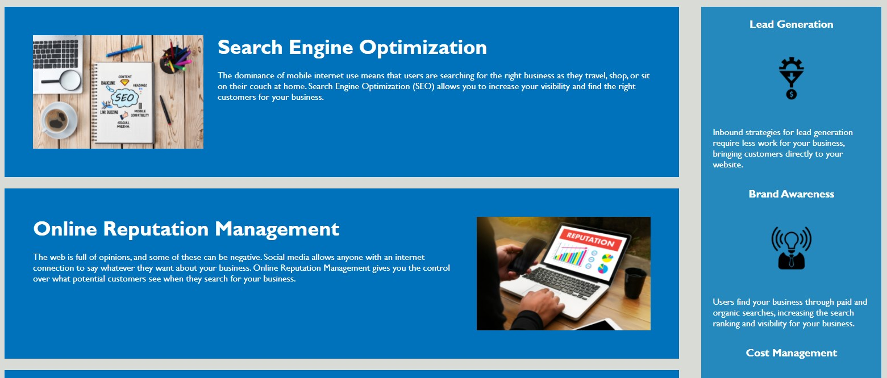
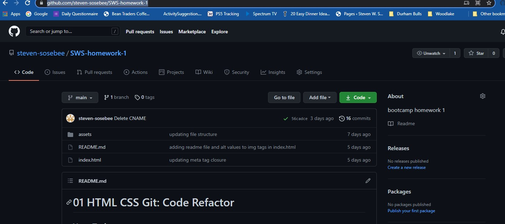

# Horiseon Home Page

## Change Log

* Refactored HTML to be more accessible.  See Elements section for more details.

* Added alt tags for images for screen reader accessibility

## Semantic Elements Used

```
<header> - designates heading including navigation bar elements
<navbar> - designates the navigation bar section and links
<section> - used for separating body sections
<aside> - used for side table along the main sections
<footer> - designated footer section
```

## Image Tags

Alt tags used for images to aid in screen reader recognition.

## Submission Details





[Github Link](https://github.com/steven-sosebee/SWS-homework-1)

[Live Link](https://steven-sosebee.github.io/SWS-homework-1/)

### Technical Acceptance Criteria: 40%

* Satisfies all of the above acceptance criteria plus the following code improvements:

  * Application's links all function correctly.
    ```
    <a href="#search-engine-optimization">Search Engine Optimization</a>

    <a href="#online-reputation-management">Online Reputation Management</a>
    
    <a href="#social-media-marketing">Social Media Marketing</a>
    ```

  * Application's CSS selectors and properties are consolidated and organized to follow semantic structure.
  [style CSS file](./assets/css/style.css)

  * Application's CSS file is properly commented.
    * Comments added to group CSS styles
      ```
      /* Header and navigation bar styles */
      
      header {
      padding: 20px;
      font-family: 'Trebuchet MS', 'Lucida Sans Unicode', 'Lucida Grande', 'Lucida Sans', Arial, sans-serif;
      background-color: #2a607c;
      color: #ffffff;
      }
      ```

### Deployment: 32%

* Application deployed at live URL.
  [Live Link](https://steven-sosebee.github.io/SWS-homework-1/)

* Application loads with no errors.

* Application GitHub URL submitted.
  
    [Github Link](https://github.com/steven-sosebee/SWS-homework-1)
* GitHub repository that contains application code.

  

### Application Quality: 15%

* Application resembles (at least 90%) screenshots provided in the homework instructions.
  

### Repository Quality: 13%

- [x] Repository has a unique name: **SWS-Homework-1**

- [x] Repository follows best practices for file structure and naming conventions.

- [x] Repository follows best practices for class/id naming conventions, indentation, quality comments, etc.

- [x] Repository contains multiple descriptive commit messages.

- [x] Repository contains quality README file with description, screenshot, and link to deployed application.

## Review

You are required to submit the following for review:

- [x] The URL of the deployed application.

- [x] The URL of the GitHub repository. Give the repository a unique name and include a README describing the project.
